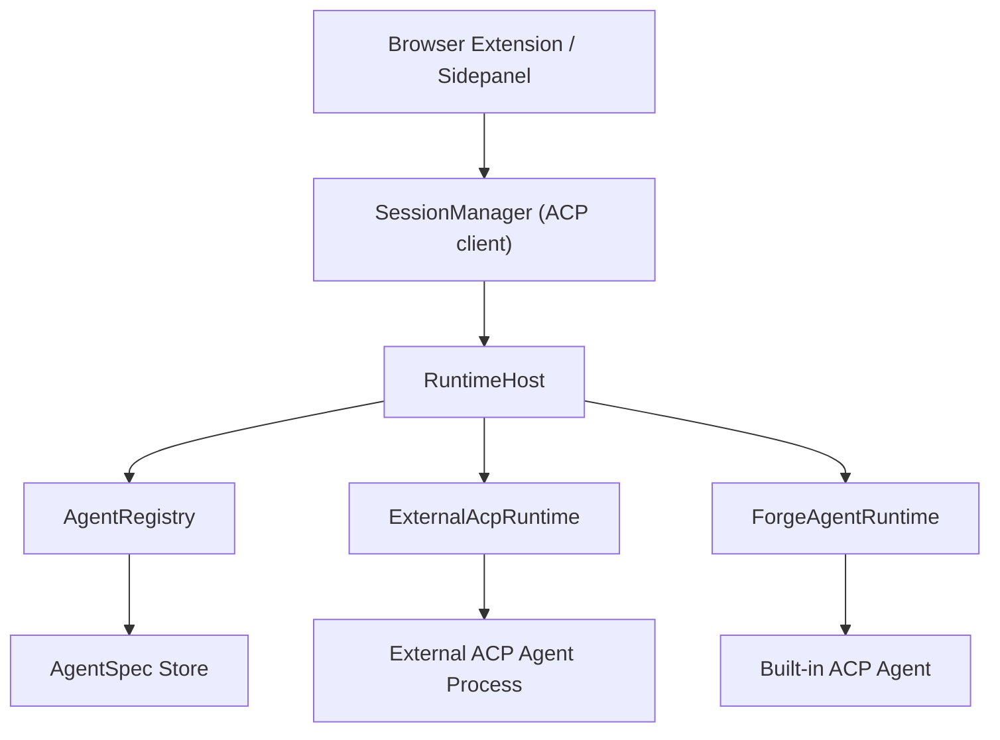

# Browser ACP Agent Host Architecture Design

## Goal

Upgrade Browser ACP from a CLI-oriented bridge into an ACP-native multi-agent host.

The new architecture keeps ACP as the only interaction protocol between a session and an agent, while introducing a configurable agent runtime layer that can start and manage both external ACP agents and built-in agents.

The target outcome is:

- external ACP agents are added only through the settings page
- no automatic local CLI discovery is required
- each conversation session is bound to one agent
- `SessionManager` acts as the ACP client for the conversation
- `RuntimeHost` starts and owns the selected agent runtime
- built-in agents can have rich configuration, tools, policies, and slash commands without changing ACP

## Core Principles

### ACP is the only interaction protocol

ACP defines how the client and agent interact. Browser ACP must not introduce a second internal conversation protocol that replaces or shadows ACP.

This means:

- `SessionManager` communicates with agents through ACP semantics
- external agents must expose ACP behavior
- built-in agents must implement ACP agent behavior
- tool calls, permission requests, streaming updates, completion, errors, and resume behavior flow through ACP-level interactions

Agent configuration is intentionally separate from ACP. Configuration decides how an agent is built and what capabilities it has; ACP decides how a session talks to it.

### SessionManager owns conversations

`SessionManager` remains the product-level conversation manager.

It owns:

- session creation and restoration
- session-to-agent binding
- transcript persistence
- session summaries
- prompt dispatch
- WebSocket update fan-out to the sidepanel

It does not own:

- agent configuration
- agent startup details
- local command discovery
- built-in agent slash command semantics
- file system or shell execution policy

### RuntimeHost owns agent startup

`RuntimeHost` is responsible for turning an agent definition into a running agent that `SessionManager` can use.

It owns:

- selecting the right runtime implementation
- starting external ACP agents
- creating built-in ACP agents
- managing process or in-memory runtime lifecycle
- cleaning up runtime resources
- reporting startup and runtime failures

It does not own transcript persistence or product conversation policy.

### AgentSpec owns configuration

`AgentSpec` is the configuration contract for defining agents.

It is not an ACP protocol object. It is Browser ACP's configuration model for describing how an agent should be presented, started, and optionally customized.

External agents and built-in agents share common identity and presentation fields, then branch into runtime-specific configuration.

## High-Level Architecture



The sidepanel continues to work through daemon session APIs. It does not need to know whether an agent is external or built in.

## Module Responsibilities

### Browser Extension / Sidepanel

Responsibilities:

- render agent list, session list, transcript, tools, permissions, and debug UI
- collect page context and user input
- call daemon session APIs
- provide a settings page for external agent configuration

Boundaries:

- does not start agents directly
- does not infer local CLI availability
- does not implement agent behavior
- does not interpret built-in agent slash commands as product-level behavior

### SessionManager

Responsibilities:

- create a session for a selected agent
- bind each session to one agent
- act as the ACP client for that session
- send prompts through the selected agent runtime
- persist transcript events and summaries
- restore sessions where supported
- broadcast session updates to connected UI clients

Boundaries:

- does not construct launch commands
- does not parse user-configured agent forms
- does not own built-in agent tools or shell execution
- does not special-case external agent implementations

### RuntimeHost

Responsibilities:

- resolve the agent selected by `SessionManager`
- choose the runtime factory by `AgentSpec.kind`
- create or resume the runtime handle for a session
- expose a uniform ACP-agent-facing handle to `SessionManager`
- handle runtime disposal, crash reporting, and timeout policy

Runtime kinds in the first architecture:

- `external-acp`
- `builtin-forge`

Future runtime kinds can be added by registering a new factory without changing `SessionManager`.

### AgentRegistry

Responsibilities:

- load enabled `AgentSpec` records
- merge system built-in agents and user-configured external agents
- provide lookup by `agentId`
- provide catalog data to the sidepanel

Boundaries:

- does not run agents
- does not probe the local machine for installed CLIs
- does not mutate runtime state

The previous "automatic local CLI discovery" behavior should be removed from the primary flow. External agents are managed only by explicit user configuration.

### AgentSpec Store

Responsibilities:

- persist user-created external agent definitions
- persist uploaded icon metadata and managed icon assets
- expose create, update, delete, enable, and disable operations
- provide validation before records enter the registry

The storage location can remain daemon-managed local application data. The important architectural point is that the settings page becomes the only source for external agent registration.

### ExternalAcpRuntime

Responsibilities:

- launch an external ACP agent process from `AgentSpec.launch`
- connect to the process using ACP
- expose that agent to `SessionManager`
- forward ACP behavior without adding Browser ACP-specific protocol semantics

This runtime is generic. Any standard external ACP agent should be connectable through configuration only.

### ForgeAgentRuntime

Responsibilities:

- implement Browser ACP's first built-in ACP agent
- expose ACP agent behavior to `SessionManager`
- run a configurable coding-agent loop
- own built-in tools, shell execution, file system access, permission policy, slash commands, and model configuration

Forge-specific behavior belongs inside Forge modules and Forge configuration. It must not leak into `SessionManager` as hardcoded product behavior.

## AgentSpec Model

### Common Fields

All agents share these fields:

```ts
type AgentSpecBase = {
  id: string;
  name: string;
  kind: "external-acp" | "builtin-forge";
  enabled: boolean;
  description?: string;
  icon?: AgentIconSpec;
  createdAt: string;
  updatedAt: string;
};
```

Icon model:

```ts
type AgentIconSpec =
  | { kind: "url"; value: string }
  | { kind: "uploaded"; assetId: string };
```

Uploaded icons should be copied into Browser ACP-managed storage. The registry should not depend on arbitrary user file paths remaining valid.

### External ACP AgentSpec

External agents are configured through the settings page.

```ts
type ExternalAcpAgentSpec = AgentSpecBase & {
  kind: "external-acp";
  launch: {
    command: string;
    args: string[];
    env?: Record<string, string>;
    cwd?: string;
  };
};
```

The first settings UI should expose only:

- name
- launch command
- launch arguments
- icon upload or icon URL
- enabled state

Advanced fields such as environment variables, working directory, health checks, and capability hints can be added later without changing the core architecture.

### Built-in Forge AgentSpec

Forge is a built-in ACP agent with its own configuration surface.

```ts
type ForgeAgentSpec = AgentSpecBase & {
  kind: "builtin-forge";
  forge: {
    model?: string;
    systemPromptProfile?: string;
    toolset?: string[];
    commandConfig?: Record<string, unknown>;
    workspacePolicy?: Record<string, unknown>;
    permissionPolicy?: Record<string, unknown>;
    shellPolicy?: Record<string, unknown>;
    filesystemPolicy?: Record<string, unknown>;
  };
};
```

These fields are intentionally outside ACP. They define how the built-in agent behaves internally while it still presents itself as an ACP agent.

## Settings Page Direction

The settings page becomes the only entry point for external agents.

User flow:

1. User opens settings.
2. User creates an external agent.
3. User fills in name, launch command, launch args, and icon.
4. The extension saves the configuration through daemon APIs.
5. `AgentRegistry` exposes the configured agent in the sidepanel.
6. Creating a session starts the external ACP runtime from that spec.

This removes ambiguity from the product:

- Browser ACP no longer guesses installed CLIs.
- Users explicitly manage the agents they trust.
- External agent setup is inspectable and editable.

## Session Flow

### Create Session

1. Sidepanel sends `createSession(agentId, context)`.
2. `SessionManager` creates the product-level session record.
3. `SessionManager` asks `RuntimeHost` for an ACP agent handle for the selected `agentId`.
4. `RuntimeHost` loads the `AgentSpec` from `AgentRegistry`.
5. `RuntimeHost` creates the matching runtime.
6. `SessionManager` binds the session to that agent handle.
7. Transcript and summary persistence begin.

### Send Prompt

1. Sidepanel sends a prompt to the daemon session endpoint.
2. `SessionManager` sends the prompt as the ACP client for the bound session.
3. The selected agent responds through ACP behavior.
4. `SessionManager` persists transcript updates.
5. UI clients receive WebSocket updates and render the transcript.

### Resume Session

1. User opens a previous session.
2. `SessionManager` loads the stored summary and transcript.
3. `RuntimeHost` attempts to recreate or resume the agent runtime.
4. If the agent supports resume, the ACP session is restored.
5. If resume is unavailable, the system should report the limitation clearly and avoid pretending that process-local state was restored.

## Slash Commands

Slash commands are not Browser ACP product commands by default.

They belong to the selected agent:

- external agents interpret their own slash commands
- Forge interprets its own slash commands through Forge's command module
- `SessionManager` should not hardcode `/model`, `/auth`, or other command semantics

The UI may later provide autocomplete or discoverability based on agent configuration, but execution remains agent-owned.

## File System, Shell, Tools, and Permissions

These capabilities belong to agent implementations.

For external agents:

- Browser ACP communicates through ACP.
- The external agent owns its internal file, shell, tool, and permission behavior.

For Forge:

- Forge owns shell execution.
- Forge owns file system access.
- Forge owns tool orchestration.
- Forge owns permission policy and approval flow.
- Forge configuration determines what is allowed.

`SessionManager` should only observe these interactions through ACP-level behavior. It should not become a shell executor or file system policy engine.

## Proposed Repository Organization

Daemon-side target layout:

```text
apps/acp-daemon/src/
  agents/
    agentSpec.ts
    configStore.ts
    registry.ts
  runtime/
    runtimeHost.ts
    runtimeFactory.ts
    types.ts
  backends/
    external-acp/
      externalAcpRuntime.ts
      factory.ts
    forge/
      forgeAgentRuntime.ts
      commandRouter.ts
      filesystemExecutor.ts
      permissionManager.ts
      shellExecutor.ts
      toolExecutor.ts
  session/
    sessionManager.ts
    sessionStore.ts
    prompt.ts
```

Extension-side target layout:

```text
apps/browser-extension/src/
  settings/
    AgentSettingsPage.tsx
    agentSettingsBridge.ts
    iconUpload.ts
```

These paths are directional targets, not a requirement to move everything in one commit.

## Migration Plan

### Phase 1: Configuration-Driven External Agents

- introduce `AgentSpec`
- introduce daemon-side config store for user-defined external agents
- add settings page for name, command, args, and icon
- remove automatic local CLI discovery from the primary catalog flow
- make catalog read from registry/config instead
- keep the current external ACP runtime behavior working

### Phase 2: RuntimeHost Extraction

- extract runtime creation out of `SessionManager`
- introduce `RuntimeHost`
- add runtime factories by `AgentSpec.kind`
- make `SessionManager` depend on an ACP-agent handle instead of concrete process startup details

### Phase 3: Forge Built-in Agent

- add `builtin-forge` agent spec
- implement Forge as an ACP agent inside the daemon
- add initial Forge loop
- add shell, file system, permission, and tool modules behind Forge configuration

### Phase 4: Agent Configuration Expansion

- expand Forge configuration
- add command discoverability for built-in slash commands
- add stricter policy controls
- add import/export for external agent specs if needed

## Non-Goals

This design does not include:

- changing ACP itself
- replacing ACP with a private Browser ACP conversation protocol
- implementing Forge in the first architecture-only step
- supporting automatic local CLI discovery
- forcing all external agents to expose the same private slash commands
- making `SessionManager` understand every agent-specific command

## Success Criteria

The architecture is successful when:

1. An external ACP agent can be added from settings without code changes.
2. Automatic local CLI discovery is no longer required for external agents.
3. Each session binds to one agent and interacts with it through ACP.
4. `SessionManager` no longer owns agent startup details.
5. `RuntimeHost` can start both external ACP agents and built-in agents.
6. Forge-specific configuration and slash commands remain outside the ACP protocol layer.
7. Sidepanel rendering and transcript persistence work the same way regardless of agent implementation.

## Recommended First Implementation Slice

Start with the smallest slice that proves the architecture:

1. Add `AgentSpec` types and config storage.
2. Add daemon APIs for listing, creating, updating, and deleting external agent specs.
3. Replace automatic discovery with registry-driven catalog output.
4. Add a settings page for external ACP agents.
5. Extract runtime startup behind `RuntimeHost` without changing session behavior.

This slice delivers immediate product value while preparing the codebase for Forge.
