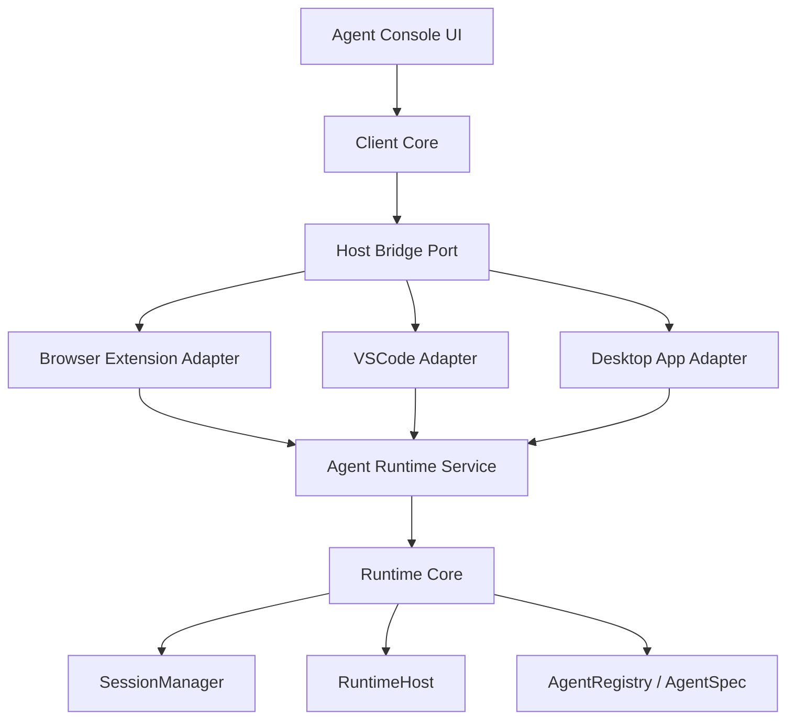

# Browser ACP Multi-Host Reuse Architecture Design

## Goal

Restructure Browser ACP so the same product capabilities can be embedded in multiple host environments:

- Chrome extension side panel
- VSCode extension webview
- desktop application renderer
- future app shells that need the same agent console and runtime

The goal is not to build every host immediately. The goal is to define boundaries that make the current browser extension one host implementation rather than the product architecture itself.

## Problem

The current implementation is organized around the Chrome extension environment:

- the foreground UI is the Chrome `sidePanel`
- the browser background service worker brokers extension messages
- the native host starts the daemon
- the daemon runs session and agent logic

This works for the browser extension, but it makes reuse difficult. VSCode, Electron, Tauri, and other app frameworks have different foreground containers and different background process models.

If Browser ACP remains coupled to Chrome APIs, every new host will need to reimplement too much product behavior.

## Target Principle

Split the system into reusable product core and host-specific adapters.

The desired layering is:

- reusable foreground UI
- reusable client state and transcript logic
- host bridge interface
- platform-specific host adapters
- reusable runtime core
- platform-specific runtime node adapters

In short:

**UI should not know the host. Runtime should not know the host. Host adapters should be the only platform-specific layer.**

## High-Level Architecture



The browser extension becomes one adapter implementation. It should not define the reusable product boundary.

## Layer Responsibilities

### 1. Agent Console UI

Reusable React UI for the agent console.

Responsibilities:

- render agent list
- render session list
- render transcript
- render message composer
- render tool calls and permission requests
- render debug and settings surfaces
- present host-provided context information

Boundaries:

- no direct `chrome.*` calls
- no direct VSCode API calls
- no direct Electron or Tauri API calls
- no daemon startup logic
- no native messaging logic

The current sidepanel UI should evolve into this package.

### 2. Client Core

Platform-neutral frontend state and orchestration.

Responsibilities:

- hold selected agent and selected session state
- aggregate transcript events into renderable thread messages
- manage optimistic prompt state where needed
- manage permission UI state
- expose hooks or store APIs for the UI package
- call the host bridge interface

Boundaries:

- no React renderer assumptions if avoidable
- no browser extension API calls
- no runtime process management
- no platform-specific context capture

This layer should make the UI reusable even if the host bridge changes.

### 3. Host Bridge Port

The contract between reusable frontend code and the host environment.

It should hide whether the current host is Chrome, VSCode, or a desktop app.

Example shape:

```ts
interface AgentConsoleHost {
  listAgents(): Promise<AgentSummary[]>;
  listSessions(): Promise<SessionSummary[]>;
  createSession(input: CreateSessionInput): Promise<SessionSummary>;
  sendPrompt(input: SendPromptInput): Promise<void>;
  interruptSession(input: InterruptSessionInput): Promise<void>;
  resolvePermission(input: ResolvePermissionInput): Promise<void>;
  getActiveContext(): Promise<HostContext>;
  subscribeSession(sessionId: string, listener: SessionEventListener): Disposable;
  openSettings?(): Promise<void>;
}
```

The exact DTO names should align with existing shared types, but the boundary should be host-neutral.

### 4. Platform Host Adapters

Each host implements `AgentConsoleHost`.

#### Browser Extension Adapter

Responsibilities:

- mount Agent Console UI into Chrome side panel
- implement host bridge through `chrome.runtime.sendMessage`
- subscribe to daemon session events through the browser extension bridge
- capture browser context from active tab, selection, page summary, and open tabs
- communicate with native host when daemon startup is required

#### VSCode Adapter

Responsibilities:

- mount Agent Console UI in a VSCode webview
- implement host bridge through VSCode webview messaging
- provide workspace context, active editor selection, diagnostics, git branch, and file metadata
- start or connect to the runtime service from the VSCode extension host

#### Desktop App Adapter

Responsibilities:

- mount Agent Console UI in the renderer process
- implement host bridge through Electron IPC or Tauri commands
- provide app-specific context
- start or connect to the runtime service through the main process

### 5. Runtime Service

Transport boundary for talking to the reusable runtime.

This can be implemented in different ways per host:

- Browser extension: native host starts a Node daemon with HTTP/WebSocket
- VSCode extension: extension host starts or embeds the runtime service
- Desktop app: main process starts or embeds the runtime service

The runtime service transport is not the product model. It is only a delivery mechanism between host adapter and runtime core.

### 6. Runtime Core

Reusable backend product core.

Responsibilities:

- `SessionManager`
- `RuntimeHost`
- `AgentRegistry`
- `AgentSpec`
- runtime factory interfaces
- transcript persistence contracts
- agent lifecycle orchestration

Boundaries:

- no Chrome API
- no VSCode API
- no Electron or Tauri API
- no HTTP request object dependency in core modules
- no native messaging dependency

The Agent Host architecture document defines this layer in more detail.

### 7. Runtime Node Adapters

Node-specific implementations for runtime infrastructure.

Responsibilities:

- local filesystem persistence
- process launching
- external ACP process management
- shell execution adapters for built-in agents
- HTTP/WebSocket server when needed
- platform path resolution

These adapters should depend on `runtime-core`, not the other way around.

## Context Provider Boundary

Different hosts provide different active context.

Browser context:

- current URL
- page title
- selected text
- page summary
- open tabs

VSCode context:

- workspace root
- active file
- selected code
- diagnostics
- git branch
- related files

Desktop app context:

- active project
- active document
- selected object
- current window state

The reusable system should model this as a host-provided `HostContext`.

The UI and session creation flow can consume `HostContext`, but context capture itself belongs to platform adapters.

## Capability Port

Platform-specific capabilities should be injected through a port instead of called directly by UI or runtime core.

Possible capabilities:

- open external URL
- copy to clipboard
- show notification
- choose local file
- upload icon asset
- reveal file
- open settings

The browser, VSCode, and desktop implementations may differ, but the reusable UI should see one capability interface.

## Proposed Package Layout

Target package split:

```text
packages/
  host-api/
    AgentConsoleHost interface
    host-neutral request and response contracts
    session subscription contracts

  client-core/
    frontend stores
    transcript aggregation
    permission state
    settings client

  ui-react/
    AgentConsole
    TranscriptView
    AgentList
    SessionList
    Composer
    Settings screens

  runtime-core/
    SessionManager
    RuntimeHost
    AgentRegistry
    AgentSpec
    runtime factory contracts

  runtime-node/
    filesystem adapters
    process launcher
    external ACP runtime implementation
    local config persistence
    HTTP/WebSocket service wrapper

apps/
  browser-extension/
    Chrome sidepanel entry
    Chrome background adapter
    native messaging adapter
    browser context provider

  vscode-extension/
    VSCode webview entry
    extension host adapter
    workspace context provider

  desktop-app/
    desktop renderer entry
    main-process adapter
    desktop context provider
```

This is a target architecture. Migration should be incremental.

## Browser Extension After Refactor

The browser extension should become a thin host shell.

It owns:

- manifest
- sidepanel entrypoint
- background service worker
- content scripts
- page context capture
- native host communication
- Browser implementation of `AgentConsoleHost`

It should reuse:

- `ui-react`
- `client-core`
- `host-api`
- `runtime-core` through the daemon/runtime service

## VSCode Extension Fit

This architecture should allow a VSCode extension to reuse the same foreground and runtime concepts.

VSCode-specific pieces:

- webview container
- extension host message bridge
- workspace context provider
- runtime startup policy

Shared pieces:

- Agent Console UI
- transcript rendering
- session state
- AgentSpec settings model
- SessionManager and RuntimeHost

The VSCode adapter becomes proof that Browser ACP is no longer browser-only.

## Desktop App Fit

Electron or Tauri can follow the same pattern.

Desktop-specific pieces:

- renderer shell
- main process command bridge
- app-specific context provider
- runtime startup and persistence location

Shared pieces:

- UI package
- client core
- runtime core
- agent configuration model

## Relationship to Agent Host Architecture

This document defines cross-host reuse boundaries.

The Agent Host architecture defines how sessions, runtimes, and agents work inside the runtime core.

The relationship is:

- Multi-host architecture decides where reusable UI, host adapters, and runtime core live.
- Agent Host architecture decides how `SessionManager`, `RuntimeHost`, `AgentRegistry`, `AgentSpec`, external agents, and built-in agents work.

They should evolve together, but they solve different problems.

## Migration Plan

### Phase 1: Extract Host Bridge

- introduce `AgentConsoleHost`
- move sidepanel bridge calls behind this interface
- keep browser behavior unchanged
- make sidepanel UI depend on the host interface rather than Chrome directly

### Phase 2: Extract Client Core

- move transcript aggregation and session UI state into platform-neutral modules
- remove browser assumptions from thread/message processing
- keep React components consuming client-core state

### Phase 3: Extract UI React Package

- move reusable panel components into `ui-react`
- make browser sidepanel only mount the UI with a browser host adapter
- keep styling and behavior stable

### Phase 4: Extract Runtime Core

- move `SessionManager`, `RuntimeHost`, `AgentRegistry`, and `AgentSpec` into runtime-core
- move Node-specific process and filesystem behavior into runtime-node
- keep daemon API behavior stable

### Phase 5: Add Second Host

- implement a minimal VSCode extension host adapter
- mount the same Agent Console UI in a VSCode webview
- connect it to the same runtime service contract

This validates the architecture with the smallest practical second host.

## Non-Goals

This design does not include:

- building the VSCode extension immediately
- building a desktop app immediately
- changing ACP semantics
- replacing the Agent Host design
- rewriting the UI all at once
- forcing every host to expose identical context data

## Success Criteria

The boundary work is successful when:

1. The Agent Console UI can run without importing Chrome APIs.
2. Browser-specific logic is isolated in the browser adapter.
3. Runtime core can run without importing browser, VSCode, or desktop APIs.
4. A new host can be added by implementing host bridge and context provider interfaces.
5. Existing browser extension behavior remains stable during extraction.
6. Agent Host concepts remain shared across all hosts.

## Recommended First Implementation Slice

Start with the smallest reusable seam:

1. Define `AgentConsoleHost` in a host API package or module.
2. Wrap current sidepanel bridge behavior with a browser implementation of that interface.
3. Make the sidepanel UI call the interface instead of concrete browser bridge functions.
4. Move transcript aggregation into a platform-neutral client-core module if it is not already isolated enough.

This creates the first real reuse boundary without changing daemon behavior.
